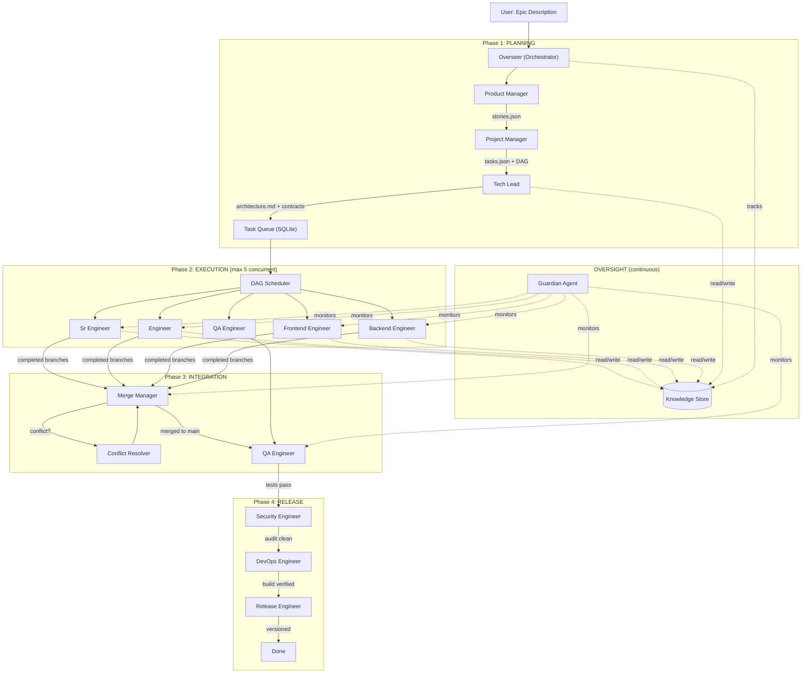
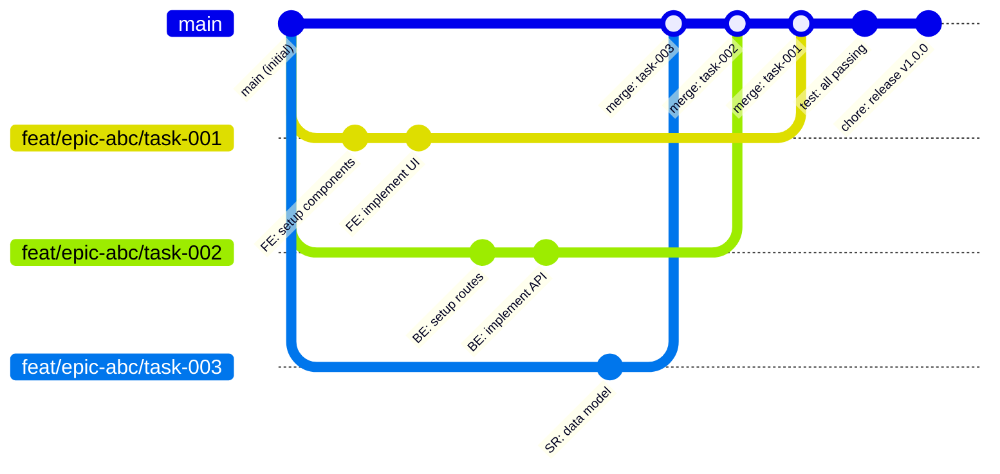
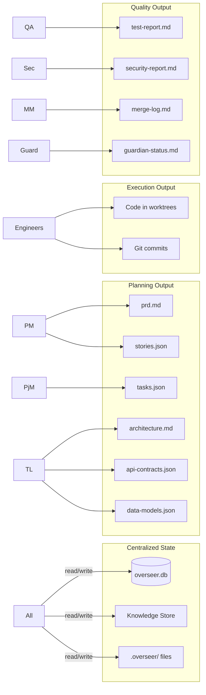
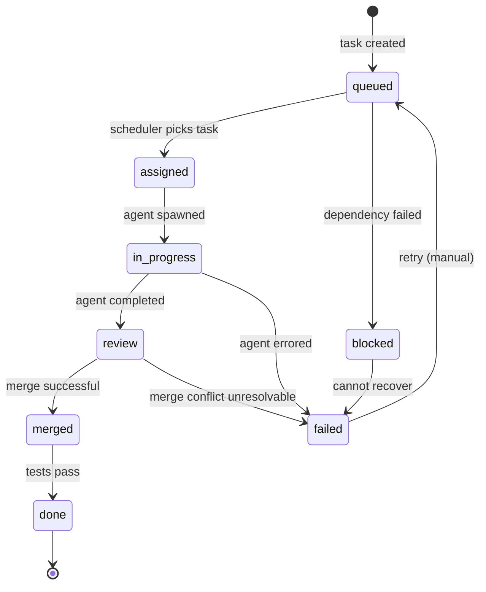

# SDLC Overseer — Architecture & Flow

## System Flow



## Git Worktree Strategy



## Data Flow



## Task State Machine



## Agent Concurrency Model

```
Time →
Slot 1: [PM      ] [Sr Eng: task-1    ] [QA: tests     ] [Release  ]
Slot 2: [PjM     ] [Eng: task-2       ] [Sec: audit    ]
Slot 3: [Tech Ld ] [FE: task-3        ] [DevOps: CI    ]
Slot 4:            [BE: task-4        ] [Merge Mgr     ]
Slot 5:            [Eng: task-5       ]
Guard:  [================ continuous monitoring ================]
```

Max 5 slots active at any time. Guardian runs in background (doesn't count against limit).

## Directory Structure

```
project-root/
├── .overseer/                    # Sprint artifacts (gitignored)
│   ├── prd.md                    # Product requirements
│   ├── stories.json              # User stories
│   ├── tasks.json                # Sprint tasks with DAG
│   ├── sprint-plan.md            # Sprint overview
│   ├── architecture.md           # Technical architecture
│   ├── api-contracts.json        # API endpoint contracts
│   ├── data-models.json          # Data model definitions
│   ├── test-report.md            # Test results
│   ├── security-report.md        # Security audit
│   ├── merge-log.md              # Merge history
│   ├── guardian-status.md        # Health monitoring
│   ├── guardian-warnings.md      # Low/medium issues
│   ├── guardian-alerts.md        # High severity issues
│   └── knowledge/                # Shared knowledge entries
│       ├── pm-decisions.json
│       ├── architecture-decisions.json
│       ├── security-findings.json
│       └── guardian-findings.json
├── .worktrees/                   # Git worktrees (gitignored)
│   ├── task-abc12345/            # One per active task
│   └── task-def67890/
├── overseer/                     # Orchestrator source
│   ├── overseer.ts               # Main entry point
│   ├── db.ts                     # SQLite schema + CRUD
│   ├── worktree.ts               # Git worktree manager
│   ├── spawner.ts                # Agent spawner
│   ├── scheduler.ts              # DAG scheduler
│   ├── knowledge.ts              # Knowledge store
│   └── types.ts                  # Shared types
└── agents/sdlc/                  # Agent definitions
    ├── product-manager.md
    ├── project-manager.md
    ├── tech-lead.md
    ├── senior-engineer.md
    ├── engineer.md
    ├── frontend-engineer.md
    ├── backend-engineer.md
    ├── qa-engineer.md
    ├── security-engineer.md
    ├── merge-manager.md
    ├── devops-engineer.md
    ├── release-engineer.md
    └── guardian.md
```

## Database Schema

```
~/.claude/data/overseer.db

epics           → id, title, description, status, timestamps
stories         → id, epic_id, title, description, AC, priority, points
tasks           → id, story_id, title, type, role, status, worktree, branch, deps[]
agent_sessions  → id, task_id, role, pid, status, output, error
knowledge       → id, epic_id, category, key, value, source_agent
merge_queue     → id, task_id, branch, status, conflict_files
sprint_log      → id, epic_id, event_type, details, agent_role, timestamp
```
